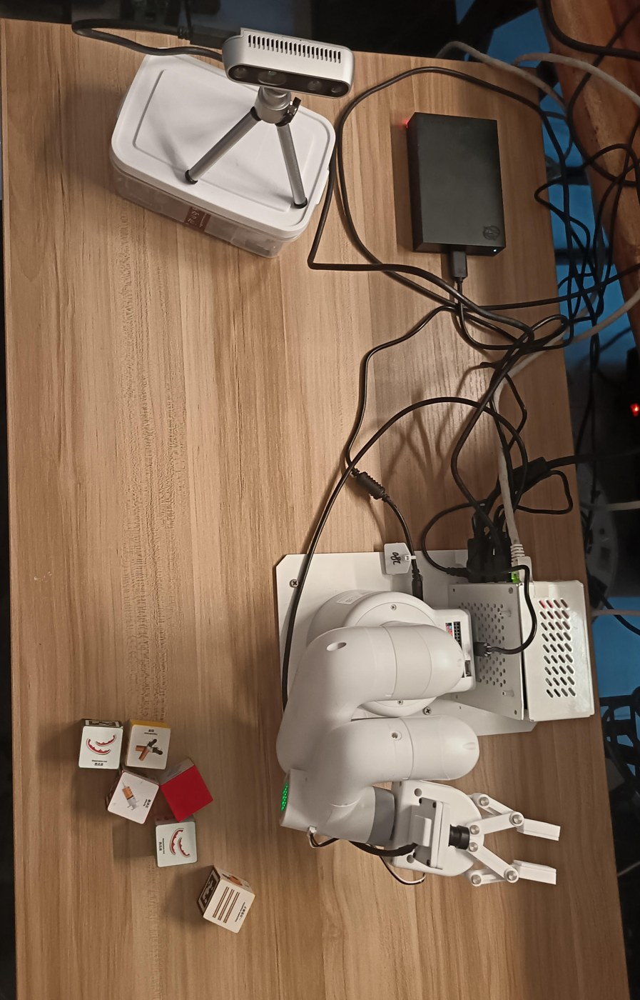
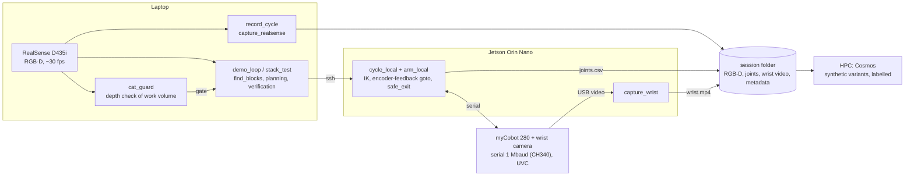
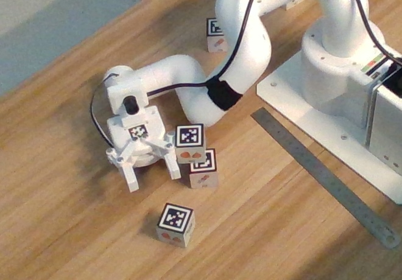

# myCobot 280 + Jetson Orin: a real-hardware-first robot lab

This repo holds the code, measurements and methods for a small desktop robot lab. An **Elephant Robotics myCobot 280
(Arduino)** arm is driven from a **Jetson Orin Nano Super**. A fixed **Intel RealSense D435i** watches the table from a
tripod, and a **wrist camera** rides on the gripper. The arm picks and places 30 mm AprilTag blocks and builds small
towers. Every move is recorded as synchronised RGB-D video, wrist video and joint angles, so the recordings can
later train world models (e.g. NVIDIA Cosmos).



*Top-down view on the first day: arm on its base plate, Jetson in a case beside it, RealSense on a mini tripod
(later moved higher), USB hard drive, 30 mm blocks.*

## How this differs from a simulation-first twin

A companion project, [kouroshSA/xarm6-digital-twin-v5](https://github.com/kouroshSA/xarm6-digital-twin-v5), starts
from a MuJoCo digital twin of a UFACTORY xArm6 on a rail, with Claude planning tasks in simulation through an
XArmAPI-compatible interface. This repo goes the other way. It started on the real arm, and simulation is
used only where it was checked against the hardware.

| | xarm6-digital-twin-v5 (per its README) | this repo |
|---|---|---|
| Arm | UFACTORY xArm6 on a 700 mm rail | myCobot 280 Arduino: 6 DoF, 250 g payload, 280 mm reach |
| Starting point | MuJoCo scene; the real arm is behind an API-compatible backend | the real arm on day one; the URDF is used only for kinematics, checked against the controller (1.0 mm RMS) |
| Object positions | known in simulation | measured: RealSense + AprilTags, camera↔arm calibration, touch probes |
| Where Claude acts | in the runtime loop (Claude API plans each task) | during development: Claude Code writes the scripts, runs the arm over ssh and keeps the lab notebook; no LLM in the motion loop |
| Motion accuracy | whatever the simulation gives | measured errors, corrected with encoder feedback and correction tables backed by evidence |
| Data | 60 Hz simulated trajectories (HDF5) | real sessions: RGB-D ~30 fps, joints ~10–15 Hz, wrist camera ~7–8 fps, clock offset; ~1 GB per move |

The two approaches are complementary. A simulation twin is fast to iterate in. A small real arm shows everything the
twin leaves out: the arm sags under gravity, servos heat up, cables drag, cameras have blind spots, cats push the
blocks around, and an opened gripper does not mean a block was placed.

**[docs/METHODOLOGY.md](docs/METHODOLOGY.md) describes the method in detail.**

## Architecture

The laptop sees and plans, the Jetson moves the arm, and every move ends up in one session folder.



## What works (as of 2026-09-27)

- **Autonomous pick-and-place loop** (`scripts/demo_loop.py`): the RealSense finds tag-up blocks. The loop picks one
  at random and places it at a random free spot, recording each move, and camera-verifies each placement on the next pass.
  An unattended 11-move run placed 9 blocks with camera-verified errors of **7.1–21.7 mm**. One earlier run
  had 6/6 first-attempt grasps and 6/6 tag-up placements.
- **Two-block towers**: 2 of 4 level-1 stacks stood (both had square grips). No 3-high tower has stood yet.
- **Recording pipeline**: one command records RGB-D, wrist video, commanded and measured joints, and the laptop↔Jetson
  clock offset into one session folder, with metadata that includes the git hash.
- **Safety layers**: servo temperature limits, stall detection, path floors, "park before release", a depth-based
  **cat guard** that gates every move, and a put-back routine if an error happens while the arm holds a block.
- **Chess (prospective)**: an arm-independent chess layer is tested in software for a larger arm. See
  [docs/CHESS.md](docs/CHESS.md).



## Repository layout

| Path | Contents |
|---|---|
| [`docs/METHODOLOGY.md`](docs/METHODOLOGY.md) | The approach: measure first, human teaching, calibration, corrections, safety, data |
| [`docs/LAB_NOTEBOOK.md`](docs/LAB_NOTEBOOK.md) | Edited, dated engineering log: what failed, what we measured, what fixed it |
| [`docs/PICK_PLACE_PROTOCOL.md`](docs/PICK_PLACE_PROTOCOL.md) | The current pick-and-place procedure and its correction table |
| [`docs/CLAUDE_CODE_WORKFLOW.md`](docs/CLAUDE_CODE_WORKFLOW.md) | How the lab was run with Claude Code as the operator, and the rules that came out of incidents |
| [`docs/HARDWARE.md`](docs/HARDWARE.md), [`docs/JETSON_SETUP.md`](docs/JETSON_SETUP.md) | Hardware facts (measured) and Jetson bring-up, including the CH340 driver |
| [`docs/CHESS.md`](docs/CHESS.md) | Prospective: chess with a larger arm, including a board the arm draws itself |
| `scripts/` | Everything that runs (catalogue below) |
| `cat_guard/` | Depth-based intrusion check for the work area ([README](cat_guard/README.md)) |
| `movements/` | Movement files: versioned JSON waypoints, replayable on the arm |
| `config/` | Camera↔arm calibrations (timestamped; rejected ones kept in `config/rejected/`), named poses, sites, chess piece tags |
| `models/mycobot_280_arduino/` | Official URDF (BSD-3-Clause, Elephant Robotics; license included) |
| `assets/` | Pixel-exact AprilTag strips for a Brother P-touch label printer (and some cat icons) |

Recorded data (`data/`, ~140 GB) is not in this repo.

## Hardware

- myCobot 280 for Arduino. The controller answers at **1,000,000 baud**, not the documented 115200. Its USB bridge is a CH340.
- Jetson Orin Nano Super, JetPack 7.2.1. Its kernel lacks the CH340 driver, so `scripts/build_ch341.sh` builds one.
- Intel RealSense D435i on the **laptop** (USB 3 via USB-C; the Jetson attempts were unstable).
- A UVC wrist camera on the Jetson (640×480, ~7–8 fps).
- A "picker" parallel gripper pointing straight down. The fingers close at 45° to the flange axes, which was measured with a guided grasp.

Details and sources: [docs/HARDWARE.md](docs/HARDWARE.md).

## Setup

Two machines: the **laptop** (camera, planning, recording) and the **Jetson** (serial link to the arm). The laptop
reaches the Jetson over ssh.

```bash
# Laptop (Ubuntu, Python 3.12)
python3 -m venv ~/venvs/realsense
~/venvs/realsense/bin/pip install -r requirements-laptop.txt
export JETSON_HOST=nvidia@<jetson-address>     # used by the laptop-side scripts

# Jetson (JetPack 7.2.1, Python 3.12)
sudo bash scripts/build_ch341.sh               # CH340 serial driver; rerun after kernel updates
python3 -m venv ~/venvs/mycobot
~/venvs/mycobot/bin/pip install -r requirements-jetson.txt
# the laptop scripts rsync scripts/ movements/ models/ config/ to ~/orin-mycobot on the Jetson
```

First checks, with no motion:

```bash
ssh $JETSON_HOST '~/venvs/mycobot/bin/python ~/orin-mycobot/scripts/probe_arm.py'   # firmware, servo temps, angles
~/venvs/realsense/bin/python scripts/probe_realsense.py                            # camera streams
```

Before any motion, read the safety section of [docs/METHODOLOGY.md](docs/METHODOLOGY.md#safety). The constants in
the scripts (REST pose, joint windows, grasp heights, corrections) were **measured on our arm, gripper and table**.
They are starting points for yours, not values to trust.

## Script catalogue

**Arm basics (Jetson):** `probe_arm.py` (read-only), `jog_joint.py`, `move_joints.py`, `sweep_joint.py` (stall
detection + back-off), `guide_joint.py`, `run_movement.py` (movement files with limit, temperature and arrival checks),
`chain.sh`, `unpark_here.py`, `arm_pose.py`, `teach_local.py` (limp-arm teaching, logged).

**Kinematics:** `kinematics.py` (URDF forward kinematics in the controller frame, numerical IK), `fk_check.py` (URDF vs.
controller), `gen_movements.py` (validated movement library), `far_side.py` (IK branches: working tilt, far reach, picker).

**Fast local control (Jetson):** `arm_local.py` (one serial connection, encoder-feedback `goto`, touch `probe`,
`safe_exit`), `cycle_local.py` (one pick/place cycle with grasp search, put-back on error), `probe_local.py`,
`reach_touch_local.py`, `jaw_calib_local.py`, `tour_local.py`, `map_local.py`, `wrist_scan_local.py`, `wrist_look.py`.

**Perception (laptop):** `detect_tags.py`, `find_blocks.py` (tags → arm frame by ray-plane; fixes the PnP mirror
ambiguity), `calibrate_cam_arm.py` (held-tag reprojection calibration), `wrist_calib.py`, `wrist_map.py`, `handtag_fit.py`.

**Recording:** `capture_realsense.py`, `capture_wrist.py`, `record_session.py` (movement file + all streams),
`record_cycle.py` (cycle + all streams), `index_sessions_20260927_123000.py` (one row per session).

**Tasks:** `demo_loop.py` (autonomous pick-and-place with verification), `stack_test_20260927_165000.py` (towers),
`pyramid_test_20260927_204500.py`, `pyramid.py`, `cycle.py`, `precise.py`, `touch_grasp.py` (earlier far-side versions).

**Media and extras:** `make_cosmos_clips.py` (real clips for Cosmos conditioning), `make_promo_cut_20260926_171000.py`,
`make_ptouch_tags_20260925_202148.py`, `make_ptouch_cat_icons_20260926_130000.py`, `chess_core_20260926_200952.py`.

Scripts with a timestamp in the name follow the lab's rule that new programs get a timestamp so that outputs can be
traced to them.

## Status and limitations

This is a working lab, not a product. Known open problems are listed in
[docs/PICK_PLACE_PROTOCOL.md](docs/PICK_PLACE_PROTOCOL.md#known-open-problems). The main ones:

- Placement error is 5–40 mm, mostly because the block's position across the finger width varies from grasp to grasp.
- Some grasps come out skewed, and the cause hasn't been found.
- The far side of the table is only covered by extrapolating the camera calibration.

A larger arm is coming, and the chess work is aimed at it.

## License

MIT (see [LICENSE](LICENSE)). The URDF in `models/mycobot_280_arduino/` is from
[elephantrobotics/mycobot_ros](https://github.com/elephantrobotics/mycobot_ros) under BSD-3-Clause
([license](models/mycobot_280_arduino/LICENSE_mycobot_ros.txt)).
