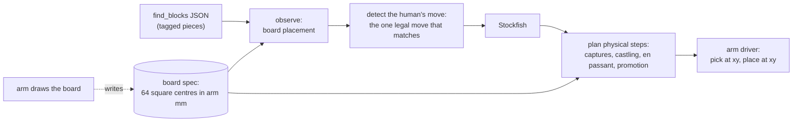

# Chess (prospective)

**Status: software only, tested offline. No chess piece has been moved by an arm yet.** This part is written for a larger
arm that is on its way. It describes a plan and the tests that support it, not a result.

## Why not on the myCobot 280

Choosing a move is easy. Stockfish runs on the Jetson or laptop, and tagged pieces give the board state directly. The
limits are physical, and each one was measured on this arm:

- **Reach.** The graspable band is **r 120–243 mm**, only ~12 cm deep.
- **Square size.** Blocks are 30 mm, and a grasp needs ~45 mm between block centres for the fingers. An 8×8 board would be
  ~36 cm deep, three times the band.
- **Reliability.** A game is ~40 robot moves plus captures, so ~50 picks. At 95% per pick, the chance of a game with no
  failed pick is (0.95)^50 ≈ 8%.

A larger arm solves reach. Reliability is handled by design (below).

## Design: arm-independent

`scripts/chess_core_20260926_200952.py` works entirely in **arm-frame millimetres**. Any arm that can "pick the block at
(x, y) and place it at (x, y)" can carry out its steps.

- **Pieces are tagged blocks.** Each piece has its own AprilTag 36h11 ID, **100–131** for the starting set and **132–139** for spare
  promotion pieces (Q, Q, N, R per colour). IDs 1–4, 10–17 and 30–34 are already used by the lab's blocks, base plate and
  gripper. The mapping is in `config/chess_pieces_20260926_200952.json`. Piece symbols can be printed next to the tags for the
  human player.
- **Physical steps.** A capture first moves the captured piece to the next free graveyard slot. Castling moves the king, then
  the rook. En passant removes the pawn beside the destination. A promotion moves the pawn to the graveyard and places a piece
  of the promoted type from the reserve, else from the graveyard, else it **asks the human** to place one.
- **Board state from the camera.** Top-face tags are snapped to the nearest square centre (within 0.35 × square size). The
  code warns about unknown tags, off-square pieces and two pieces on one square.
- **Human-move detection.** It finds the legal move whose result matches the observed board. The tests found this to be
  always unique.
- **Failures as part of the game.** The arm verifies its own move with the camera. If a grasp fails, it asks for help ("could
  you put my knight on c3?"), which turns ~90% reliability into a playable game.

## A board the arm draws itself

The operator suggested that the arm **draw its own board** with a pen. The drawn coordinates *are* the board, so no
calibration between board and arm is needed, and the board can be sized (or curved along the reach arc) to fit the
arm. That is why the board spec is a list of 64 square centres in arm millimetres rather than a fixed grid:
a drawing program can write exactly what it drew. `--make-grid` makes a regular board spec for testing.

Practical notes for the drawing step: a spring-loaded pen or felt tip absorbs the few millimetres of vertical sag the
encoder-feedback loop leaves. The pen trace also measures the arm's real accuracy for free.

## Tests (offline, passed 2026-09-26)

`python scripts/chess_core_20260926_200952.py --selftest` (python-chess 1.11.2, Stockfish 17.1):

- **A real game.** The Opera Game (Paris 1858) is replayed through planning and simulated execution to checkmate in 33 plies. After
  every ply, the tracked physical position of each tag matches the chess position, and the human-move detector returns exactly the
  move that was played.
- **Special moves.** En passant, castling on both sides, promotion with capture, and underpromotion.
- **Stress.** 300 games of random legal moves (a test of the rules code, not data): 80,874 plies, 704 promotions, 22 cases
  where the "ask the human for a piece" fallback was needed. The first run found a real limit: with many promotions, more than 32 pieces
  can leave the board, so the graveyard now has 48 slots.
- **Camera path.** A real `find_blocks` snapshot from the lab parses correctly (its tags are not chess pieces, as expected).

`--play` runs a terminal game against Stockfish and prints each arm step with its coordinates. No arm moves.

## Next steps

1. Print the 40 piece tags (the label-printer scripts in `scripts/make_ptouch_tags_*.py` do this pixel-exact).
2. Write the board-drawing routine; it writes the board spec.
3. Write an arm driver for the new arm: `pick(x, y)`, `place(x, y)`, park and verify, reusing the grasp search and camera
   verification from the myCobot work.
4. Start with **pointing chess**: the arm points at its move and the human moves the piece. This tests perception, the engine and the
   board without any grasps.
