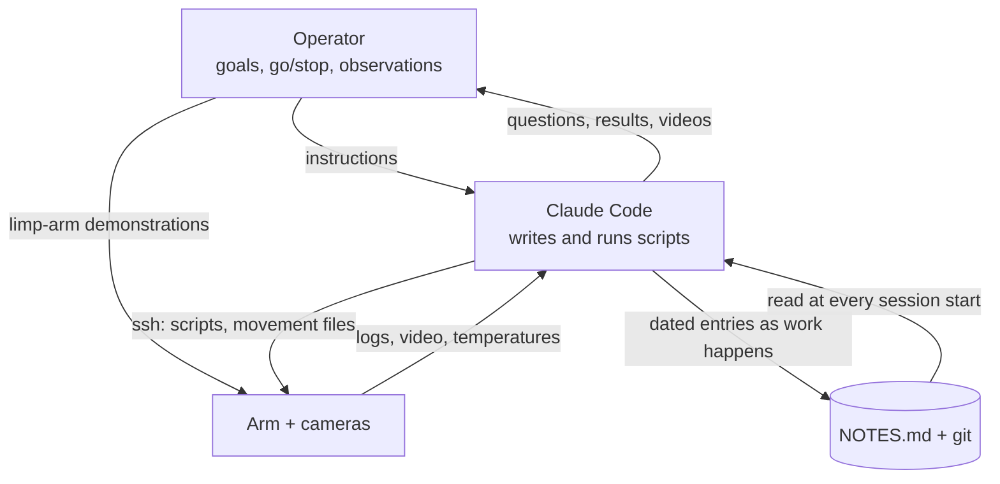

# Running the lab with Claude Code

Most of this repo was written, and nearly all of the arm was driven, by [Claude Code](https://www.anthropic.com/claude-code)
acting as the lab's operator-assistant. It wrote the scripts, ran them on the Jetson over ssh, watched the recordings and
temperatures, and kept the notebook. The human operator set goals, gave go/stop decisions, demonstrated motions with a limp
arm, and reported what they saw. **No language model sits in the motion loop.** Every motion is ordinary, checked Python.

This differs from the companion [xarm6-digital-twin-v5](https://github.com/kouroshSA/xarm6-digital-twin-v5), where
Claude (via the API) plans tasks at runtime. Here Claude is the developer and lab technician; the robot runs deterministic code.

## The notebook is the record, not the chat

The first Jetson session kept no notes, and its history had to be rebuilt from the transcript. After that, the repo's
`CLAUDE.md` required:

- Read `NOTES.md` and `PLAN.md` at the start of every session.
- Add a dated entry **as work happens**: every hardware change, measurement, command that fixed something, decision,
  and user instruction, with the numbers.
- Keep a "Current status" section at the top.
- Commit documentation after each meaningful step.

Several sessions were long-running or ran in parallel (one agent built the cat guard while another ran the arm). The notebook was
how they handed work over. Corrections are written as corrections, and wrong entries are struck through, not deleted
(e.g. "~~the RealSense view changed~~ **WRONG:** the camera never moved: 0.0 px shift").

[LAB_NOTEBOOK.md](LAB_NOTEBOOK.md) is an edited version of that notebook.

## Rules in `CLAUDE.md` that shaped the work

- **Data integrity.** No synthetic or placeholder data in place of measurements. Synthetic video (Cosmos) is labelled and
  linked to its real source. Promo cuts use only real, camera-verified moves.
- **Provenance.** New programs get a timestamp in the filename. Every session folder stores the git hash, arguments and software
  versions. Rejected calibrations are kept in `config/rejected/`.
- **Test before trusting.** Dry runs (planning and camera only, no motion) come before live runs. Scripts are tested on real
  recorded data offline before they drive the arm.
- **Explaining results.** Show the code and the actual numbers first. Say "I don't know" rather than rationalise.
  "Unresolved" appears often in the notebook, e.g. the Day-3 grasp regression and the skewed grips.

## How the operator and the agent split the work

| Operator | Agent (Claude Code) |
|---|---|
| Goals ("build a pyramid", "keep doing until it's perfect") | Plans, scripts, dry runs, live runs |
| Go/stop, and authorising unattended runs | Obeys stop files; parks after every move |
| Limp-arm demonstrations of postures and grasps | Logs them and turns them into IK branches and offsets |
| What they saw ("the bottom of the hand is hitting", "it's on the forward edge of the cube") | Turns observations into measurements and corrections |
| Physical fixes: cables, camera mount, block placement | Checks the camera for drift before trusting the calibration again |
| sudo-level system changes (run as scripts they execute) | Everything else, without asking the operator to type commands |

The biggest improvements came from the operator's observations and demonstrations, not from parameter search. The agent's
job was to make each one measurable and repeatable.

## Incidents and the rules they produced

These are the agent's own errors and the failures it caused or missed. They are listed because each one changed the code.

| What happened | Consequence | Rule / fix |
|---|---|---|
| A shell chain continued after one step was refused and ran an unvalidated move that rotated J1 by 191° | No contact, by luck | `scripts/chain.sh`; chains stop on any refusal; always check the *runner's* exit code, not `grep`'s |
| The laptop session was interrupted; the remote script died on a write to a closed pipe before its safe exit | The arm hovered, powered, for ~15 min; J5 reached 63 °C | `safe_exit` survives dead pipes; SIGHUP/SIGTERM → safe exit |
| `release_all_servos()` from a raised pose | The arm "dropped like a rock" | Park at REST first; release only as the last step of `park` |
| Held the upright photo pose while "cooling" | J5 reached **70 °C**, the servo's own limit | Any cooling wait parks first; the photo pose is never held |
| A cat-guard intrusion was printed but not acted on (the motion script did not check the guard itself) | The arm moved with a cat at the back of the table; no contact | Every motion script calls the guard and waits; never chain motion after a check without testing its exit code |
| A 3-high stack planned from a 10-minute-old scene | Block released 60 mm above an already-dismantled tower | Level ≥ 2 requires a fresh camera check of the tower |
| Reported "placed" as success | A failed move went into a promo draft | Camera verification decides success |
| Claimed the wrist camera was recorded during cycles when it wasn't | Missing wrist video for early cycles | Corrected in the notes the same day; `record_cycle` now records it |

## Unattended runs

Motion normally happens only with a person in the room. The operator explicitly authorised unattended rehearsal runs,
with the room closed. Those runs rely on the cat guard (no timeout), temperature cooling, pausing after 3 misses, stop files, and
a watchdog that ends the session for good on "no reachable blocks", a crash, or a run limit.

## Tips if you do this with your own arm

- Give the agent read-only probes first (`probe_arm.py`, `probe_realsense.py`), then single-joint jogs at low speed, then
  movement files with checks. Widen its authority only as the checks prove themselves.
- Make the agent write the notebook entry before the next command, not at the end of the day.
- Ask for dry runs that print the planned targets. Read them.
- When the numbers stall, demonstrate with a limp arm and have the agent log it.
