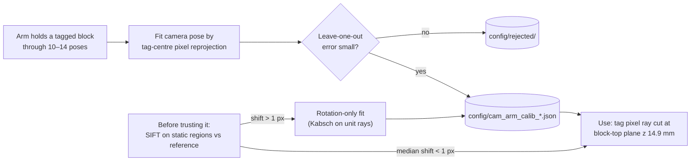
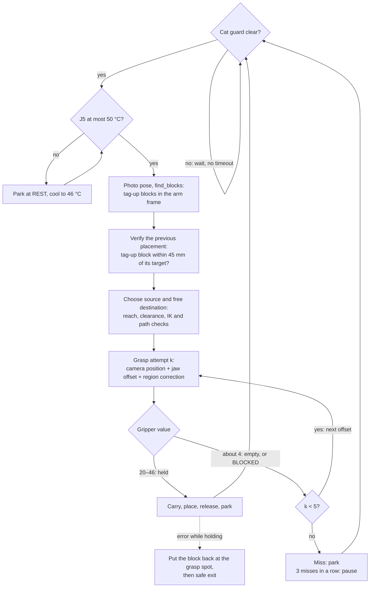
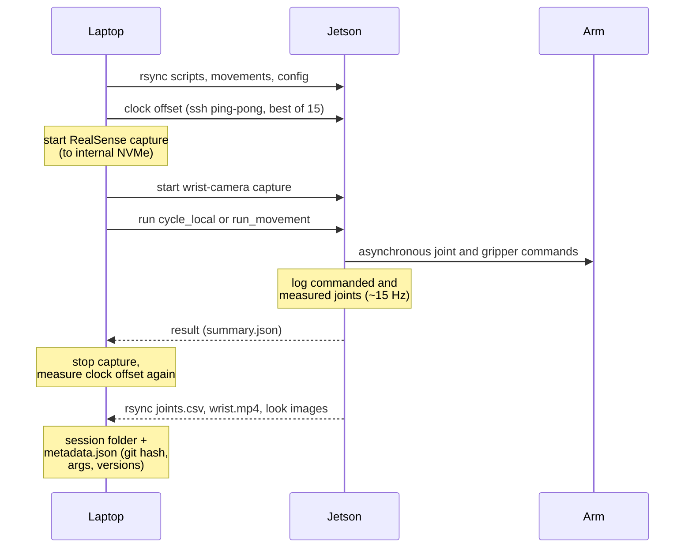

# Methodology

This lab was built around one rule: **measure it on the hardware before you rely on it.** A small, inexpensive
arm is a good teacher here, because it breaks nearly every assumption a clean model makes. This document covers the
approach and the numbers behind each choice. The dated record of how we got here is in
[LAB_NOTEBOOK.md](LAB_NOTEBOOK.md).

- [1. Real hardware first](#1-real-hardware-first)
- [2. Kinematics: use the URDF, but check it](#2-kinematics-use-the-urdf-but-check-it)
- [3. The human teaches with a limp arm](#3-the-human-teaches-with-a-limp-arm)
- [4. Positioning with encoder feedback](#4-positioning-with-encoder-feedback)
- [5. Perception and camera↔arm calibration](#5-perception-and-cameraarm-calibration)
- [6. Grasping: search, corrections, verification](#6-grasping-search-corrections-verification)
- [7. Movements are data; every move is recorded](#7-movements-are-data-every-move-is-recorded)
- [8. Safety](#safety)
- [9. From recordings to world models](#9-from-recordings-to-world-models)
- [10. What we would do again, and what not](#10-what-we-would-do-again-and-what-not)

## 1. Real hardware first

The companion project [xarm6-digital-twin-v5](https://github.com/kouroshSA/xarm6-digital-twin-v5) builds the world in
MuJoCo first and then connects a real arm behind an API-compatible backend. We started with the real arm and added
models only where the hardware could check them. Many of the facts that mattered were not in the documentation,
and some contradicted it:

| Assumption | What we measured |
|---|---|
| Serial at 115200 baud (vendor docs) | The controller answers only at **1,000,000 baud** |
| The controller does inverse kinematics | `solve_inv_kinematics` returns −1 for every query on this firmware, so we wrote our own IK |
| Joints reach their targets | Up to **5° short** under gravity load (J2, J5 extended); correct when the arm is upright |
| Collisions are detected | A move that **hit the camera tripod** reported no error |
| Releasing the servos lowers the arm gently | "Damped" release from a raised pose: J2 fell 49° and J4 75° in ~6 s. The arm "dropped like a rock" |
| The fingertip is 100 mm from the flange | The hand meets the table 15–20 mm below the model fingertip point, depending on posture |
| Temperature readings are true | J3 read 56/65/73 °C between normal 32 °C readings. These were corrupted reads, so guards take the minimum of 3 |
| A gripper that opened at the target means the block was placed | Not true. Only a camera check counts (§6) |

All of these came up in the first three days. Every one of them would have been invisible in simulation.

## 2. Kinematics: use the URDF, but check it

- **Check the official URDF against the controller.** We logged 7 pairs of (joint angles, `get_coords`) and fitted
  the URDF forward kinematics to them (`scripts/fk_check.py`). Result: **1.0 mm RMS, max 1.6 mm**, with the controller
  angles used directly, the controller frame being the URDF root rotated 270° about z, and a ~3 mm shift. The orientation
  matched with **0.0°** error as R = Rz·Ry·Rx. So the URDF reproduces the controller's own model. It does *not*
  predict where the physical hand ends up.
- **Our own IK in the controller frame** (`scripts/kinematics.py`). This is a numerical solver with a *path check*: every
  waypoint pair is interpolated, and every joint frame and the fingertip must stay above a floor.
- **Different postures need different IK branches** (`scripts/far_side.py`). The arm used three over time:
  1. *Working tilt* (tool 60° from vertical). It keeps the wrist camera clear of the forearm (J5 ≥ ~48), and it
     reaches r 120–243 mm.
  2. *Far reach* (tilt 60°, lean 60°). This reaches r 200–300 mm, but it **sags 20–23 mm**.
  3. *Picker* (tool vertical). The operator discovered this posture by moving the arm by hand (§3). It reaches
     r 150–270 mm, and in practice ≈ r 260 at hover height. This is the posture in use now.

The workspace was then **mapped physically** (`scripts/map_local.py`). At r 150–200 mm, the forward kinematics of the
read angles lands within 0.3–3.3 mm of the target after correction. At r 250 the error is 5–9 mm. Beyond r ≈ 260 the
arm cannot be pushed to the target at all.

## 3. The human teaches with a limp arm

The largest improvements came from **kinesthetic teaching**. The servos are released while the arm rests low, a person
guides it, and the joint angles are logged at ~10 Hz (`scripts/teach_local.py`), with the RealSense recording at the same time.

- **The picker posture.** For a day the grasps used the tilted hand, because an early test showed the wrist
  hitting the forearm near J5 ≈ 40°. After a guided demonstration, the operator reported: *"the hand is trying to
  grip nearly parallel to the table, it should be angled down much more … like a picker."* The demonstrated poses had
  the tool 3–14° from vertical with J5 ≈ 0–5. That showed the J5 limit applied only to the other IK branch, so
  the picker branch was built from that demonstration.
- **The jaw centre.** A guided grasp around a real block showed that the fingers close at **45° to the flange x/y**
  and that the jaw centre sits at **(+7, +18) mm** in the flange frame from the model fingertip. Before this, grasps
  kept missing, with the fingers closing "between the two blocks" at "45°, the worst angle". After it, grasps
  succeeded first time.

The pattern held throughout: when numbers stalled, **one short demonstration by a person was worth hours of
parameter search.**

## 4. Positioning with encoder feedback

The arm sags, and the sag depends on the pose, so commanded angles are not reached. `arm_local.goto()` closes the loop
using the arm's own encoders. It commands a pose, reads back the angles, computes the forward kinematics of the
fingertip, and re-commands the target shifted by the error, for up to 4 iterations. One correction took a far-side
target from **14.6 mm to 0.9 mm** error. The correction that converged on the way down is carried into the next
waypoint (`init_off`), which cut the jittery corrections at each stage.

This fixes the model's view of the arm, not the real world's: encoder-based kinematics cannot see a bent finger
or a wrong jaw offset. That is why the camera checks in §5–6 are still needed.

Touch is also useful as a measurement. With the gripper closed, stepping down 5 mm at a time
(`precise.probe`, `probe_local.py`) finds the table or a block top: contact is a step that moves less than 2 mm while the
command is more than 3 mm below the measured tip. Touch tests set the hand floor
(+5 mm at the working tilt, +12 mm on the picker branch, +21 mm on the far-reach branch) and settled a conflict between the camera and
the arm model about table height (§5).

## 5. Perception and camera↔arm calibration

- **Blocks** are 30 mm cubes with AprilTag 36h11 markers. Ours came with IDs 1–4, each on two blocks, so blocks are
  tracked by position. We later printed pixel-exact tags on a Brother P-touch label printer
  (`scripts/make_ptouch_tags_*.py`: 128 px = the whole 180 dpi print head, measured 18.0 mm).
- **Held-tag reprojection calibration** (`scripts/calibrate_cam_arm.py --reproj`). The arm holds a tagged block
  through a tour of 10–14 poses. The solver fits the camera pose by minimising the *pixel* reprojection error of the tag
  centre, not 3-D distances, because PnP range at ~1 m is only good to ±2 cm. Result after the camera was remounted:
  **0.27 px, leave-one-out 1.0 mm**. Fits with too few visible holds are rejected, and the rejected files are kept in
  `config/rejected/` (e.g. 13.8 mm fit, 34 mm leave-one-out).

- **Ray-plane block positions** (`scripts/find_blocks.py`). Each tag-centre pixel ray is intersected with the plane of the
  block tops (z 14.9 mm, measured at a verified pick). Repeatability went from ±2 cm (PnP range) to **0.1 mm run to run**.
- **The PnP mirror ambiguity.** IPPE_SQUARE sometimes returned the mirrored solution, so tag-up blocks read as "side"
  faces with the normal ≈ (−0.7, 0.5, 0.5). The fix uses `solvePnPGeneric` and prefers the near-vertical solution when its
  reprojection error is within 2× the best + 0.5 px. After that fix, all top tags read n_z ≈ 0.998–1.0.
- **Is the camera still where the calibration says?** Before trusting the calibration, SIFT features in static regions
  (base plate, Jetson) are matched against a reference frame. A median shift under 1 px is fine. When a cat bumped the
  tripod, the shift was 2.2 px. A **rotation-only fit** (Kabsch on unit rays) gave 0.111° and a corrected calibration in
  minutes, with no new tour.
- **The camera's limits.** The base column hides part of the far side, the parked forearm hides some drop spots, and
  the wrist camera faces sideways. These limits became rules: drop zones exclude the camera-shadow areas, and a
  "photo pose" lifts the arm upright for the camera, which then read 6 tags instead of 3.

## 6. Grasping: search, corrections, verification

One pass of the autonomous loop (`scripts/demo_loop.py`), with its safety gates:

A single grasp in `scripts/cycle_local.py` works like this:

1. Aim at the camera position plus the jaw offset (§3) and region corrections (table below). Choose J6 to square
   the fingers to the block's yaw.
2. Hover, then descend with encoder feedback to **grasp height z 5** (model fingertip). z 13 closed above the shorter blocks.
3. Close. A gripper value of 20–46 means holding, ~4 means empty, ~100 means the gripper did not close. If a finger comes
   to rest on the block top (`stop_above=8`), the attempt is marked BLOCKED.
4. If the grasp fails, try the next offset from the search pattern: (0,0), (+8,0), (−8,0), (0,+12), (0,−12) mm, radial and tangential.
5. If an error happens while holding, set the block down where it was picked up, then run the safe exit.

**Every correction is empirical and has evidence** ([PICK_PLACE_PROTOCOL.md](PICK_PLACE_PROTOCOL.md) has the
full table). Example: grasps on the left front of the table dropped from 8/8 to 0/8 after a physical change we
never identified. We measured the error with place-and-look (put a block at a known spot, see where the camera
finds it) and corrected re-grasps, then added a −6 mm radial, −16 mm tangential correction for that region. The next run
had 5/5 first-attempt grasps.

**Verification decides success.** "placed" in a cycle summary only means the gripper opened at the target. On the
next pass the loop looks for a tag-up block within 45 mm of the target and counts the move as a miss otherwise. The
operator had to point this out ("move 1 was NOT a success"), after which verification became standard. Promotional
clips use only verified moves.

Results, 2026-09-27: 44 held grasps (37 square, 6 skewed). An 11-move unattended run placed 9 blocks tag-up with
camera-verified errors of 7.1–21.7 mm. Two-block towers stood 2 times in 4 (both with square grips), and stacking
now refuses skewed grips.

## 7. Movements are data; every move is recorded

- **Movement files** (`movements/*.json`) contain named steps of joint targets, gripper states and waits, with a speed,
  a start pose and an sha256 hash in the index. `gen_movements.py` path-checks every waypoint pair at 21 samples
  before a file is written. `run_movement.py` refuses to start if the arm is more than 8° from the start pose, and it stops
  if any joint ends more than 3° off (6° for the sagging J5).
- **Sessions.** `record_session.py` (movement files) and `record_cycle.py` (pick/place cycles) record:
  - the RealSense colour MP4 plus 16-bit aligned depth PNGs with per-frame timestamps, ~28–30 fps
  - commanded and measured joint angles on the Jetson, ~15 Hz. Commands are sent asynchronously, because pymycobot's
    blocking write retries left the log without samples during most of each move
  - wrist camera MP4, ~7–8 fps
  - the laptop↔Jetson clock offset (ssh ping-pong, best of 15 round trips) at start and end. The offset drifts
    ~80–100 ppm, so it is interpolated per frame
  - `metadata.json` with the git hash, arguments and software versions.

- **Record to fast disk, then move.** Recording depth straight to a USB hard drive dropped 1069 depth frames with gaps
  up to 5 s. Recording to the internal NVMe and copying afterwards gives 29.7 fps with no drops.
- **A session index** (`index_sessions_*.py`) has one row per session: task, arguments, frame counts, dropped frames, grasp
  attempts, grip value, temperatures, verification. By 2026-09-27 it held 204 sessions, 106 of them pick/place cycles.

## Safety

The rules below grew out of real incidents (see [CLAUDE_CODE_WORKFLOW.md](CLAUDE_CODE_WORKFLOW.md)).

- **Never release the servos or cut power from a raised pose.** Always park at the REST pose (arm lying low) first.
  `park` is allowed even when the arm is hot, because parking is how it cools.
- **Temperature.** The servos' own limit is 70 °C (Feetech STS register 13). J5, the wrist pitch, heats ~10 °C per
  pick/place move. The loop starts a move only at J5 ≤ 50 °C (all joints ≤ 52 °C), cools parked to ≤ 46 °C, and aborts
  mid-move at 62 °C. Never hold a raised "photo" pose while waiting: holding it once took J5 to 70 °C.
- **Stall detection.** A joint that ends more than 3° short, or a step that moves less than expected, stops the
  movement. The controller does not report collisions.
- **Path floors.** Every waypoint and interpolated path keeps each joint frame and the fingertip above a
  minimum height, adjusted per stage (grasp, place, drop).
- **Safe exit.** Any exception, SIGHUP/SIGTERM or dropped ssh pipe lifts the arm, returns it through safe poses to REST,
  and releases it. A killed laptop session once left the arm hovering powered for 15 minutes, because the remote
  process died on a write to a closed pipe before it could exit safely. Its messages now survive a dead pipe.
- **Cat guard.** A depth check of the work volume (a 300 mm cylinder around the base) gates every move, and the wait
  has no timeout. See [cat_guard/README.md](../cat_guard/README.md). Motion code must check its exit code itself, not
  just print it.
- **Chains stop on refusal.** A shell chain once continued after one step was refused and rotated J1 by 191° in an
  unvalidated move. `chain.sh` and `set -e` are now required.
- **People.** Moves are made at low speed with a person in the room. Unattended runs happen only after the operator
  explicitly approves them, with the room closed.

## 9. From recordings to world models

The recordings are meant for training and evaluating video world models. A first test cut 60-frame clips from
real sessions (`make_cosmos_clips.py`: 960×720, first 2 s skipped for auto-exposure, cropped to remove a person at
the frame edge). It then ran NVIDIA Cosmos video-to-video generation on a university HPC cluster: 12 videos from 5
clips on 2×H200, about 570 s each. Every output is **labelled synthetic** and linked to the real session it came from. Real
and synthetic data are never mixed without that label.

## 10. What we would do again, and what not

**Again:**
- Measure every assumption on day one: baud rate, IK support, limits, table height by touch.
- Ask the operator to demonstrate with a limp arm as soon as numbers stall.
- Calibrate by pixel reprojection with the arm holding the tag. Check for camera drift with SIFT before trusting a calibration.
- Verify outcomes with the camera, not the gripper.
- Keep a dated lab notebook as work happens, and treat chat transcripts as unreliable.

**Not again:**
- Planning from a 10-minute-old scene. A block was once released 60 mm above the table onto a tower that had already been taken down.
- Assuming a pose is low-load because it looks relaxed.
- Relying on the controller to notice collisions.
- Blocks with tags on only one face. Every miss tips a block picture-up and removes it from what the camera can use. Tag all six faces.
